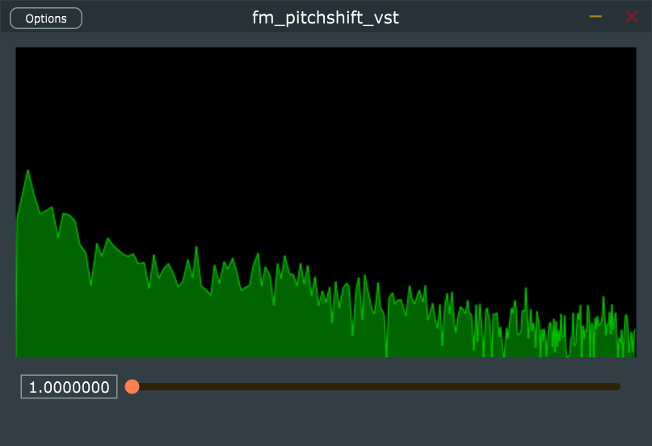

## fumi2kick vst3 plugin - PitchShift prototype

ピッチシフトプラグインを自作するための原理試作です。

VST3 ホストで利用するか、スタンドアロンアプリを起動して使用します。入力された音声を 1 倍～ 2 倍の音程に変換して出力します。低い声にはできません。

当プラグイン単体での音声遅延時間は多分 86ms 位です。

JUCE ライブラリを使用しています。

# ライセンス

License is GPLv3

当プラグインのライセンスは GPLv3 です。
JUCE ライブラリにて GPLv3 の使用を選択して利用しています。

# ビルド方法

## 用意するもの

- JUCE ライブラリと projucer
- Visual Studio community 2019 (もしくはそれ以上)

## 手順

1. juce.com から projucer を含んだ JUCE ライブラリを入手します
2. projucer を起動してライブラリパス等の初期設定を行います
3. 当リポジトリをクローンします
4. 当リポジトリ内の `fm_pitchshift_vst.jucer` を projucer にて open します
5. projucer の export で Visual Studio 2019 を選択して "Save Project and Open IDE" を実行して build project を生成します
6. Visual Studio が起動するので、ソリューションをビルドします

# 使い方

## vst3 プラグイン

vst3 プラグインの配置場所にコピーしてください。

64bit Windows では `c:\Program Files\Common Files\VST3\` へコピーします。

## スタンドアロンアプリ

`fm_pitchshift_vst.exe` を起動します。

Option でオーディオデバイスとマイクデバイスを設定してください。

# 仕組み

入力音声を FFT で周波数成分に分解し、周波数成分をシフトした後 iFFT で音声信号に戻しています。

FFT 変換した音声を色々加工して楽しむための実験コードとなります。

# credit

## author

- rerofumi (@rerofumi, @hesui_channel)

## update

- Feb.14.2021 / Ver0.1.0
  - 動作するようになったのでリリース
